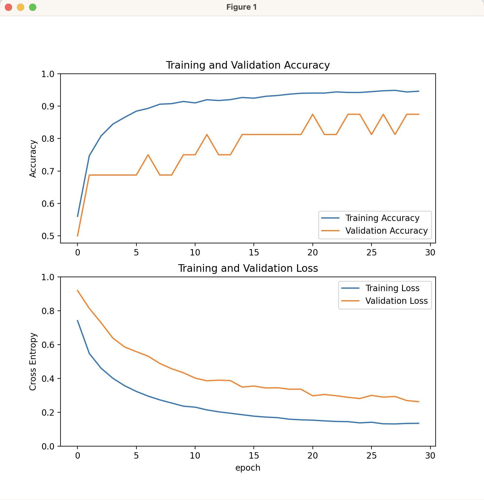

# What is this codebase about?

See [here](https://www.kaggle.com/datasets/paultimothymooney/chest-xray-pneumonia).

# How to run

I use [miniconda](https://docs.conda.io/en/latest/miniconda.html) through [Homebrew](https://formulae.brew.sh/cask/miniconda) on my Mac to setup the required environment:

```
conda create -n pneumonia -c conda-forge matplotlib tensorflow python=3.10 
conda activate pneumonia
python pneumonia.py
```

Which yields an output similar to:

```
Found 5216 files belonging to 2 classes.
Metal device set to: Apple M1 Ultra

systemMemory: 128.00 GB
maxCacheSize: 48.00 GB

2023-03-31 07:50:15.637681: I tensorflow/core/common_runtime/pluggable_device/pluggable_device_factory.cc:305] Could not identify NUMA node of platform GPU ID 0, defaulting to 0. Your kernel may not have been built with NUMA support.
2023-03-31 07:50:15.637959: I tensorflow/core/common_runtime/pluggable_device/pluggable_device_factory.cc:271] Created TensorFlow device (/job:localhost/replica:0/task:0/device:GPU:0 with 0 MB memory) -> physical PluggableDevice (device: 0, name: METAL, pci bus id: <undefined>)
Found 16 files belonging to 2 classes.
Found 624 files belonging to 2 classes.
in the training set 2 class names to classify the images for: ['NORMAL', 'PNEUMONIA']
2023-03-31 07:50:15.735158: W tensorflow/core/platform/profile_utils/cpu_utils.cc:128] Failed to get CPU frequency: 0 Hz
image batch shape: (32, 224, 224, 3)
image label shape: (32,)
Epoch 1/15
2023-03-31 07:50:17.994944: I tensorflow/core/grappler/optimizers/custom_graph_optimizer_registry.cc:113] Plugin optimizer for device_type GPU is enabled.
163/163 [==============================] - ETA: 0s - loss: 0.2535 - accuracy: 0.88522023-03-31 07:50:39.596068: I tensorflow/core/grappler/optimizers/custom_graph_optimizer_registry.cc:113] Plugin optimizer for device_type GPU is enabled.
163/163 [==============================] - 23s 131ms/step - loss: 0.2535 - accuracy: 0.8852 - val_loss: 0.3458 - val_accuracy: 0.7500
Epoch 2/15
163/163 [==============================] - 22s 132ms/step - loss: 0.1472 - accuracy: 0.9402 - val_loss: 0.2923 - val_accuracy: 0.8750
Epoch 3/15
163/163 [==============================] - 21s 130ms/step - loss: 0.1284 - accuracy: 0.9488 - val_loss: 0.3005 - val_accuracy: 0.8125
Epoch 4/15
163/163 [==============================] - 21s 128ms/step - loss: 0.1150 - accuracy: 0.9534 - val_loss: 0.2192 - val_accuracy: 0.9375
Epoch 5/15
163/163 [==============================] - 21s 127ms/step - loss: 0.1213 - accuracy: 0.9536 - val_loss: 0.2184 - val_accuracy: 0.9375
Epoch 6/15
163/163 [==============================] - 21s 129ms/step - loss: 0.0973 - accuracy: 0.9618 - val_loss: 0.1059 - val_accuracy: 1.0000
Epoch 7/15
163/163 [==============================] - 21s 131ms/step - loss: 0.0950 - accuracy: 0.9618 - val_loss: 0.1303 - val_accuracy: 0.9375
Epoch 8/15
163/163 [==============================] - 21s 129ms/step - loss: 0.0918 - accuracy: 0.9643 - val_loss: 0.0950 - val_accuracy: 1.0000
Epoch 9/15
163/163 [==============================] - 21s 131ms/step - loss: 0.0873 - accuracy: 0.9659 - val_loss: 0.0995 - val_accuracy: 1.0000
Epoch 10/15
163/163 [==============================] - 21s 129ms/step - loss: 0.0816 - accuracy: 0.9691 - val_loss: 0.0892 - val_accuracy: 0.9375
Epoch 11/15
163/163 [==============================] - 22s 133ms/step - loss: 0.0815 - accuracy: 0.9657 - val_loss: 0.1135 - val_accuracy: 1.0000
Epoch 12/15
163/163 [==============================] - 21s 127ms/step - loss: 0.0727 - accuracy: 0.9720 - val_loss: 0.0535 - val_accuracy: 1.0000
Epoch 13/15
163/163 [==============================] - 21s 127ms/step - loss: 0.0812 - accuracy: 0.9676 - val_loss: 0.0548 - val_accuracy: 1.0000
Epoch 14/15
163/163 [==============================] - 21s 127ms/step - loss: 0.0701 - accuracy: 0.9709 - val_loss: 0.0929 - val_accuracy: 1.0000
Epoch 15/15
163/163 [==============================] - 21s 129ms/step - loss: 0.0679 - accuracy: 0.9693 - val_loss: 0.0642 - val_accuracy: 1.0000
20/20 [==============================] - 1s 26ms/step - loss: 0.5201 - accuracy: 0.8494
accuracy/loss on the test dataset: 0.849/0.520
```

The learning curves of the training and validation accuracy / loss looks as following:



Finally the created environment above can be removed through:

```
conda remove --name pneumonia --all
```

The achieved accuracy on the test dataset is `.849` as it can be spotted by the last line of the log output above.
