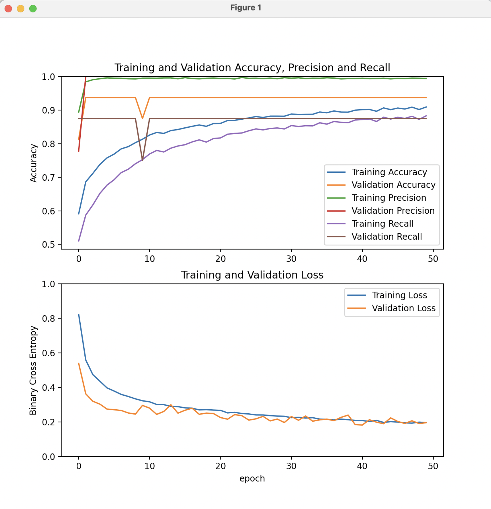

# What is this codebase about?

See [here](https://www.kaggle.com/datasets/paultimothymooney/chest-xray-pneumonia).

# How to run (on GPU)

I use [miniconda](https://docs.conda.io/en/latest/miniconda.html) through [Homebrew](https://formulae.brew.sh/cask/miniconda) on my Mac to setup the required environment. See also the details [here](https://developer.apple.com/metal/tensorflow-plugin/) about how to setup `tensorflow-metal` PluggableDevice to accelerate training with Metal on Mac GPUs. Though it didn't work out-of-the-box the way documented by the previous link on macOS 13.2.1. So this is how I managed to properly install tensorflow with GPU accelaration (status April 2023):

```
conda create -n pneumonia -c apple matplotlib tensorflow-deps python=3.10
conda activate pneumonia
pip install tensorflow-macos tensorflow-metal
pip install numpy --upgrade # fix the conflicting version of numpy
python pneumonia.py
```

Which yields an output similar to:

```
Found 5216 files belonging to 2 classes.
Metal device set to: Apple M1 Ultra

systemMemory: 128.00 GB
maxCacheSize: 48.00 GB

Found 16 files belonging to 2 classes.
Found 624 files belonging to 2 classes.
in the training set 2 class names to classify the images for: ['NORMAL', 'PNEUMONIA']
2023-04-07 22:17:11.624073: W tensorflow/tsl/platform/profile_utils/cpu_utils.cc:128] Failed to get CPU frequency: 0 Hz
image batch shape: (32, 224, 224, 3)
image label shape: (32,)
WARNING:absl:At this time, the v2.11+ optimizer `tf.keras.optimizers.Adam` runs slowly on M1/M2 Macs, please use the legacy Keras optimizer instead, located at `tf.keras.optimizers.legacy.Adam`.
WARNING:absl:There is a known slowdown when using v2.11+ Keras optimizers on M1/M2 Macs. Falling back to the legacy Keras optimizer, i.e., `tf.keras.optimizers.legacy.Adam`.
Epoch 1/30
163/163 [==============================] - 11s 54ms/step - loss: 0.4194 - accuracy: 0.7502 - precision: 0.9838 - recall: 0.6748 - val_loss: 0.2430 - val_accuracy: 0.9375 - val_precision: 1.0000 - val_recall: 0.8750
Epoch 2/30
163/163 [==============================] - 7s 45ms/step - loss: 0.2979 - accuracy: 0.8365 - precision: 0.9938 - recall: 0.7848 - val_loss: 0.3268 - val_accuracy: 0.8125 - val_precision: 1.0000 - val_recall: 0.6250
Epoch 3/30
163/163 [==============================] - 7s 45ms/step - loss: 0.2626 - accuracy: 0.8576 - precision: 0.9928 - recall: 0.8142 - val_loss: 0.3254 - val_accuracy: 0.8125 - val_precision: 1.0000 - val_recall: 0.6250
Epoch 4/30
163/163 [==============================] - 7s 46ms/step - loss: 0.2289 - accuracy: 0.8923 - precision: 0.9934 - recall: 0.8606 - val_loss: 0.2480 - val_accuracy: 0.8125 - val_precision: 1.0000 - val_recall: 0.6250
Epoch 5/30
163/163 [==============================] - 8s 46ms/step - loss: 0.2019 - accuracy: 0.9053 - precision: 0.9933 - recall: 0.8785 - val_loss: 0.1514 - val_accuracy: 0.9375 - val_precision: 1.0000 - val_recall: 0.8750
Epoch 6/30
163/163 [==============================] - 7s 46ms/step - loss: 0.1880 - accuracy: 0.9124 - precision: 0.9922 - recall: 0.8890 - val_loss: 0.2096 - val_accuracy: 0.9375 - val_precision: 1.0000 - val_recall: 0.8750
Epoch 7/30
163/163 [==============================] - 7s 45ms/step - loss: 0.1755 - accuracy: 0.9195 - precision: 0.9892 - recall: 0.9014 - val_loss: 0.2524 - val_accuracy: 0.8125 - val_precision: 1.0000 - val_recall: 0.6250
Epoch 8/30
163/163 [==============================] - 7s 45ms/step - loss: 0.1561 - accuracy: 0.9306 - precision: 0.9900 - recall: 0.9159 - val_loss: 0.1441 - val_accuracy: 0.9375 - val_precision: 1.0000 - val_recall: 0.8750
Epoch 9/30
163/163 [==============================] - 7s 46ms/step - loss: 0.1473 - accuracy: 0.9387 - precision: 0.9906 - recall: 0.9262 - val_loss: 0.1312 - val_accuracy: 1.0000 - val_precision: 1.0000 - val_recall: 1.0000
Epoch 10/30
163/163 [==============================] - 7s 45ms/step - loss: 0.1345 - accuracy: 0.9408 - precision: 0.9896 - recall: 0.9301 - val_loss: 0.1183 - val_accuracy: 0.9375 - val_precision: 1.0000 - val_recall: 0.8750
Epoch 11/30
163/163 [==============================] - 7s 46ms/step - loss: 0.1262 - accuracy: 0.9457 - precision: 0.9875 - recall: 0.9388 - val_loss: 0.1315 - val_accuracy: 1.0000 - val_precision: 1.0000 - val_recall: 1.0000
Epoch 12/30
163/163 [==============================] - 7s 45ms/step - loss: 0.1212 - accuracy: 0.9542 - precision: 0.9898 - recall: 0.9481 - val_loss: 0.1270 - val_accuracy: 1.0000 - val_precision: 1.0000 - val_recall: 1.0000
Epoch 13/30
163/163 [==============================] - 7s 45ms/step - loss: 0.1129 - accuracy: 0.9528 - precision: 0.9876 - recall: 0.9484 - val_loss: 0.1393 - val_accuracy: 1.0000 - val_precision: 1.0000 - val_recall: 1.0000
Epoch 14/30
163/163 [==============================] - 7s 46ms/step - loss: 0.1089 - accuracy: 0.9578 - precision: 0.9880 - recall: 0.9548 - val_loss: 0.1576 - val_accuracy: 0.9375 - val_precision: 0.8889 - val_recall: 1.0000
Epoch 15/30
163/163 [==============================] - 8s 46ms/step - loss: 0.1015 - accuracy: 0.9576 - precision: 0.9888 - recall: 0.9538 - val_loss: 0.1170 - val_accuracy: 0.9375 - val_precision: 1.0000 - val_recall: 0.8750
Epoch 16/30
163/163 [==============================] - 7s 45ms/step - loss: 0.1030 - accuracy: 0.9601 - precision: 0.9875 - recall: 0.9585 - val_loss: 0.2244 - val_accuracy: 0.9375 - val_precision: 0.8889 - val_recall: 1.0000
Epoch 17/30
163/163 [==============================] - 7s 46ms/step - loss: 0.0955 - accuracy: 0.9601 - precision: 0.9867 - recall: 0.9592 - val_loss: 0.1385 - val_accuracy: 1.0000 - val_precision: 1.0000 - val_recall: 1.0000
Epoch 18/30
163/163 [==============================] - 7s 45ms/step - loss: 0.0933 - accuracy: 0.9638 - precision: 0.9858 - recall: 0.9652 - val_loss: 0.0879 - val_accuracy: 1.0000 - val_precision: 1.0000 - val_recall: 1.0000
Epoch 19/30
163/163 [==============================] - 7s 45ms/step - loss: 0.0837 - accuracy: 0.9684 - precision: 0.9900 - recall: 0.9672 - val_loss: 0.0735 - val_accuracy: 1.0000 - val_precision: 1.0000 - val_recall: 1.0000
Epoch 20/30
163/163 [==============================] - 7s 45ms/step - loss: 0.0903 - accuracy: 0.9638 - precision: 0.9868 - recall: 0.9641 - val_loss: 0.1034 - val_accuracy: 1.0000 - val_precision: 1.0000 - val_recall: 1.0000
Epoch 21/30
163/163 [==============================] - 7s 45ms/step - loss: 0.0869 - accuracy: 0.9663 - precision: 0.9871 - recall: 0.9672 - val_loss: 0.1711 - val_accuracy: 0.9375 - val_precision: 0.8889 - val_recall: 1.0000
Epoch 22/30
163/163 [==============================] - 7s 45ms/step - loss: 0.0868 - accuracy: 0.9641 - precision: 0.9865 - recall: 0.9649 - val_loss: 0.1740 - val_accuracy: 0.9375 - val_precision: 0.8889 - val_recall: 1.0000
Epoch 23/30
163/163 [==============================] - 7s 46ms/step - loss: 0.0814 - accuracy: 0.9693 - precision: 0.9856 - recall: 0.9729 - val_loss: 0.1909 - val_accuracy: 0.9375 - val_precision: 0.8889 - val_recall: 1.0000
Epoch 24/30
163/163 [==============================] - 7s 45ms/step - loss: 0.0807 - accuracy: 0.9693 - precision: 0.9869 - recall: 0.9716 - val_loss: 0.1006 - val_accuracy: 1.0000 - val_precision: 1.0000 - val_recall: 1.0000
Epoch 25/30
163/163 [==============================] - 7s 45ms/step - loss: 0.0805 - accuracy: 0.9688 - precision: 0.9889 - recall: 0.9688 - val_loss: 0.1309 - val_accuracy: 1.0000 - val_precision: 1.0000 - val_recall: 1.0000
Epoch 26/30
163/163 [==============================] - 7s 45ms/step - loss: 0.0805 - accuracy: 0.9684 - precision: 0.9866 - recall: 0.9706 - val_loss: 0.0929 - val_accuracy: 1.0000 - val_precision: 1.0000 - val_recall: 1.0000
Epoch 27/30
163/163 [==============================] - 7s 45ms/step - loss: 0.0761 - accuracy: 0.9695 - precision: 0.9869 - recall: 0.9719 - val_loss: 0.1358 - val_accuracy: 0.9375 - val_precision: 0.8889 - val_recall: 1.0000
Epoch 28/30
163/163 [==============================] - 7s 45ms/step - loss: 0.0741 - accuracy: 0.9712 - precision: 0.9882 - recall: 0.9729 - val_loss: 0.1273 - val_accuracy: 0.9375 - val_precision: 0.8889 - val_recall: 1.0000
Epoch 29/30
163/163 [==============================] - 7s 45ms/step - loss: 0.0679 - accuracy: 0.9737 - precision: 0.9900 - recall: 0.9745 - val_loss: 0.1150 - val_accuracy: 1.0000 - val_precision: 1.0000 - val_recall: 1.0000
Epoch 30/30
163/163 [==============================] - 7s 45ms/step - loss: 0.0711 - accuracy: 0.9724 - precision: 0.9892 - recall: 0.9734 - val_loss: 0.0584 - val_accuracy: 1.0000 - val_precision: 1.0000 - val_recall: 1.0000
20/20 [==============================] - 1s 30ms/step - loss: 0.4106 - accuracy: 0.8718 - precision: 0.8414 - recall: 0.9795
the accuracy/precision/recall scores on the test dataset: 0.872/0.841/0.979 with a loss of: 0.411
```

The learning curves of the accuracy/precision/recall metrics look as the following:



Finally the created environment above can be removed through:

```
conda remove --name pneumonia --all
```

The achieved accuracy/precision/recall scores on the test dataset is `.872/.841/.979` as it can be spotted by the last line of the log output above.
